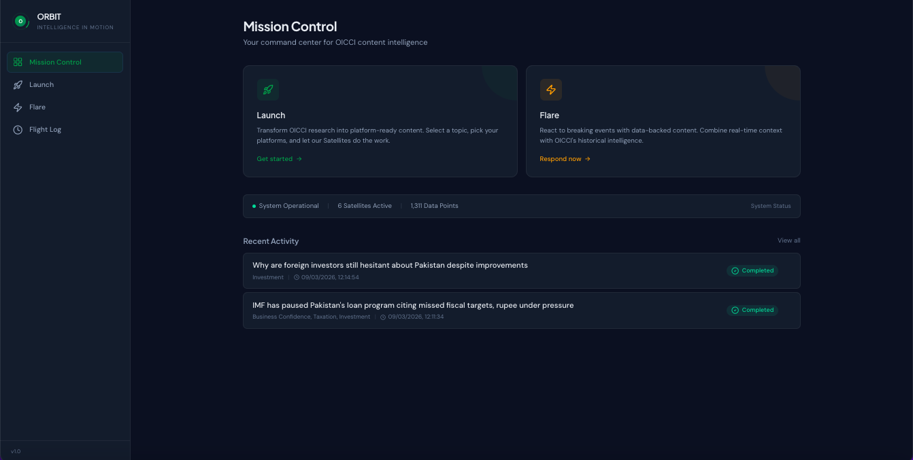
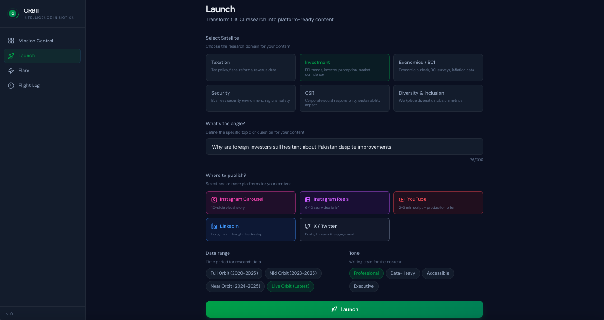
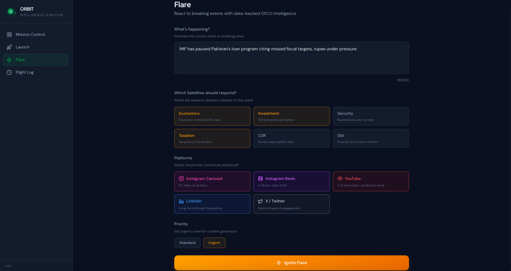
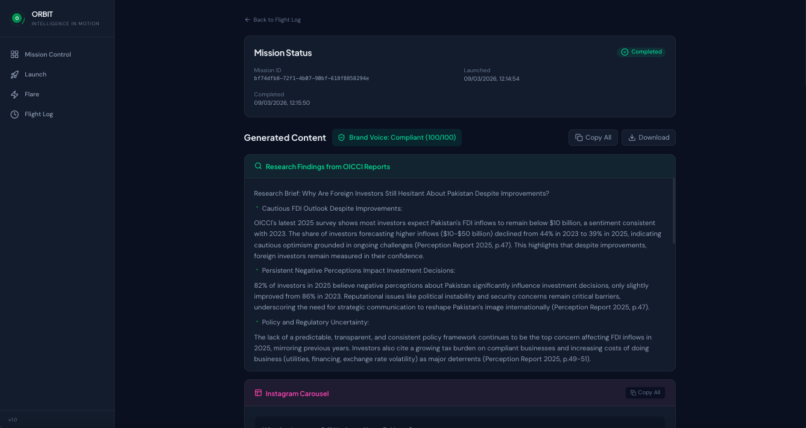
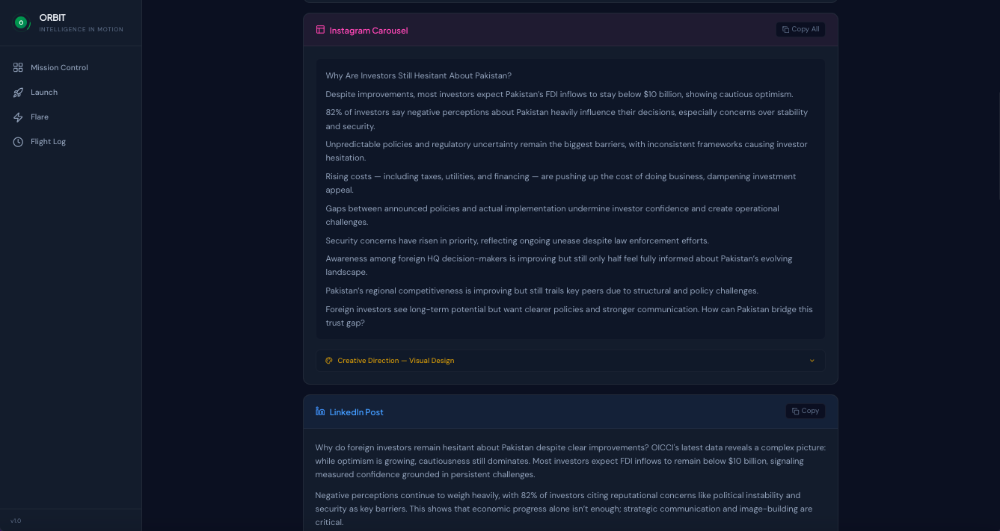
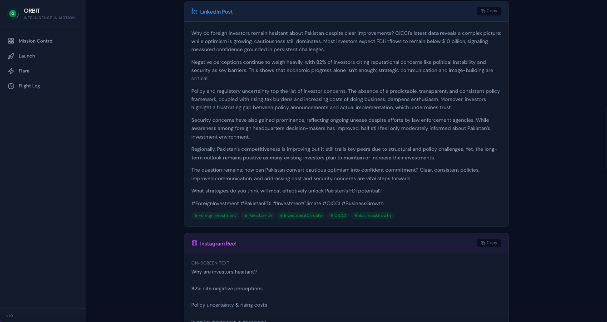
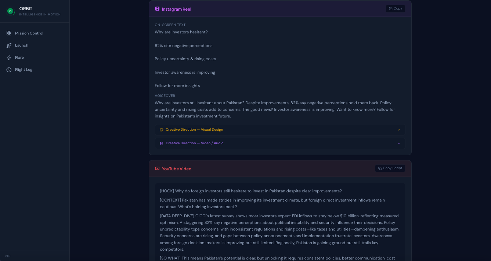
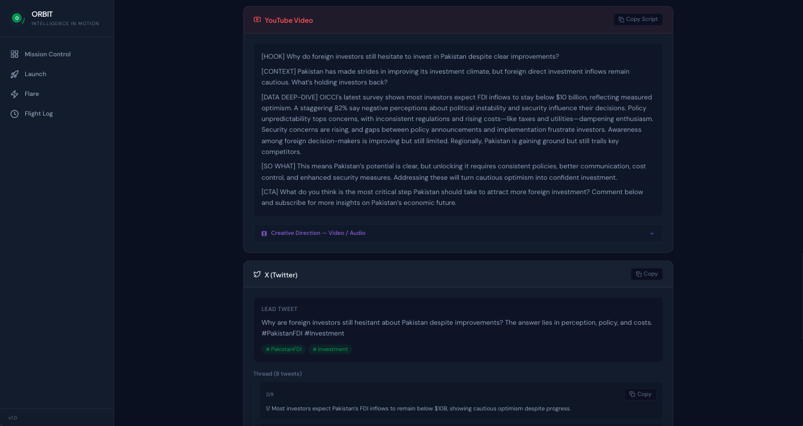
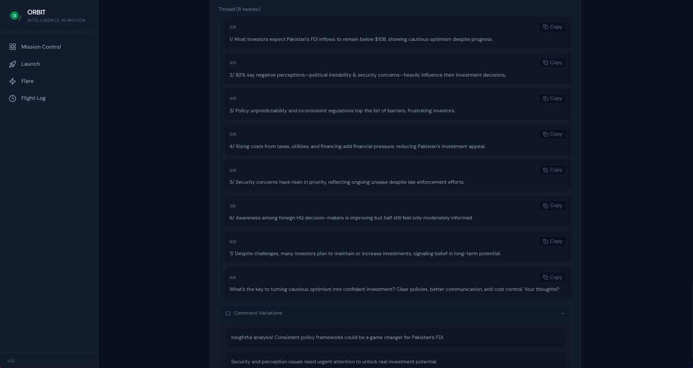
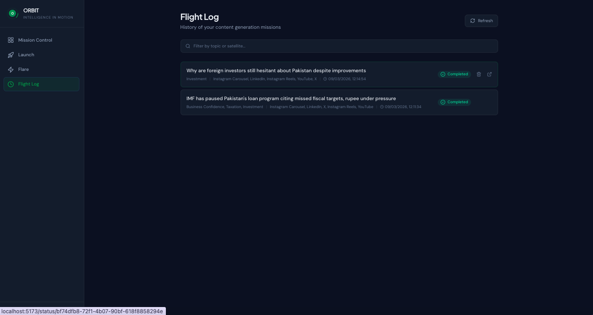

# 🛰️ Orbit - Rag Content Engine
### *Intelligence in Motion*

> Multi-agent RAG system that ingests research documents and generates platform-ready social media content for LinkedIn, Instagram, YouTube and X.

---

## 🔎 What Is This?

**Orbit** is an AI-powered content automation system built for organizations that produce research — think industry reports, surveys, policy papers, whitepapers — and need to turn that research into social media content consistently and at scale.

You feed it documents. It builds a searchable knowledge base. Then specialized AI agents (called **Satellites**) retrieve the most relevant data and write platform-native content — LinkedIn posts, Instagram carousels, YouTube scripts, X threads — all grounded in your actual research, with no hallucinated statistics.

It has two modes:

- **Launch** — Generate content from your document knowledge base on any topic
- **Flare** — Respond to breaking events by combining live web intelligence with your historical research data, producing analyst-style reactive content in minutes

---

## 🖥️ Screenshots

<table>
  <tr>
    <td></td>
    <td></td>
  </tr>
  <tr>
    <td></td>
    <td></td>
  </tr>
  <tr>
    <td></td>
    <td></td>
  </tr>
  <tr>
    <td></td>
    <td></td>
  </tr>
  <tr>
    <td></td>
    <td></td>
  </tr>
</table>

---

## ⚙️ How It Works

```
Research PDFs  →  Qdrant Vector DB  →  CrewAI Agents  →  Platform Content
                   (hybrid search)     (GPT-4.1 Mini)    LinkedIn / Instagram
                                                          YouTube / X
                              ↑
                   DuckDuckGo Web Search (Flare mode only)
```

1. **Ingestion** — PDFs are parsed, semantically chunked, embedded with OpenAI `text-embedding-3-large`, and stored in Qdrant (7 domain collections)
2. **Retrieval** — Hybrid search (dense vectors + BM25) with cross-encoder re-ranking for precise, citation-accurate results
3. **Generation** — CrewAI sequential agents run research → content writing → creative direction tasks per request
4. **Flare synthesis** — For reactive content, per-domain research is synthesized into one unified analytical brief before content writing — no messy multi-domain dumps
5. **Output** — Structured JSON returned to a React UI with an orbital loading animation during generation, rendered as platform cards with copy/download buttons and creative direction briefs inside each visual/video card

---

## 🧱 Tech Stack

| Layer | Technology |
|---|---|
| **Agent Framework** | CrewAI |
| **LLM** | OpenAI GPT-4.1 Mini |
| **Vector DB** | Qdrant (embedded, no Docker needed) |
| **Embeddings** | OpenAI text-embedding-3-large (3072-dim) |
| **Re-ranking** | cross-encoder/ms-marco-MiniLM-L-6-v2 |
| **Web Search** | DuckDuckGo (Flare mode) |
| **Backend** | FastAPI + Python 3.12 |
| **Frontend** | React 19 + Vite + Tailwind CSS 4 |
| **PDF Parsing** | pdfplumber + unstructured |

---

## 📤 What It Outputs

| Platform | Output |
|---|---|
| **LinkedIn** | 1,500–1,800 char thought-leadership post — bold hook, context setup, data bullets (3-4 items), analyst "so what" layer, closing question, hashtags |
| **X (Twitter)** | Lead tweet + 5–7 tweet thread + comment variations |
| **Instagram Carousel** | 10-slide story arc — hook → data → insight → CTA |
| **Instagram Reels** | Hook, on-screen text, voiceover script, visual concept |
| **YouTube** | Full 2–3 min script (400–500 words) with [HOOK] [CONTEXT] [DATA DEEP-DIVE] [SO WHAT] [CTA] — word counts enforced per section |

**Creative direction briefs** (design style, AI tool prompts for Runway/HeyGen/ElevenLabs) are generated inside the relevant platform cards — not as a separate section.

**Brand voice validation** runs server-side on every output.

---

## 🏢 Who Is This For?

This system is built for **any organization that sits on research and struggles to distribute it**:

- **Think tanks and research institutes** that publish reports but have limited content teams
- **Chambers of commerce and trade bodies** that produce surveys and policy papers
- **Consulting firms** that generate client-facing research and need to market it
- **Financial institutions and banks** with regular economic outlook publications
- **NGOs and development organizations** with annual reports and impact studies
- **Any brand with a knowledge base** — product documentation, case studies, internal data

If your team is manually writing LinkedIn posts from 80-page reports, this solves that problem.

---

## 💡 What It Saves

- **Time** — Turning a research report into 5-platform content manually takes hours. Orbit does it in 1–3 minutes.
- **Consistency** — Every output uses the same brand voice rules. No one goes off-tone.
- **Accuracy** — Content is grounded in your documents. No AI making up statistics. Every data point in the Research Findings section has a full citation.
- **Reactive speed** — When a major event hits, Flare lets you respond in minutes with a fully data-backed take, not a rushed opinion piece.

---

## 🔧 Built to Be Customized

Orbit is not a fixed product — it is a framework that can be adapted to your organization's knowledge base:

- **Swap the document corpus** — Point it at your own PDF archive, organized by any domain structure you choose
- **Swap the LLM** — The system is model-agnostic. GPT-4.1 Mini is the default; Claude, Gemini, or any OpenAI-compatible model can be dropped in
- **Swap the web search provider** — DuckDuckGo is isolated in one file. Replace with Perplexity, Brave, or any API
- **Add or remove platforms** — Platform cards and agent tasks are modular
- **Add brand voice rules** — The brand voice validation layer reads from a plain text file you can edit
- **Add guardrails** — Content approval workflows, restricted topics, publishing permissions can all be integrated

---

## 🚀 Quick Start

```bash
# 1. Install Python dependencies
python3 -m venv .venv && source .venv/bin/activate
pip install -r requirements.txt

# 2. Add your API keys to .env
OPENAI_API_KEY=sk-...

# 3. Ingest your documents (one-time)
python -m src.ingestion.ingest_all

# 4. Install frontend dependencies
cd frontend && npm install && cd ..

# 5. Run
./run.sh
# Frontend: http://localhost:5173
# Backend:  http://localhost:8000
```

---

## 📬 Contact & Custom Build

If you're an organization interested in deploying a version of this system for your own research library, or a developer who wants to collaborate:

- 📧 **Email** — [adeelmemon096@yahoo.com](mailto:adeelmemon096@yahoo.com)
- 💼 **LinkedIn** — [linkedin.com/in/adeeliqbalmemon](https://linkedin.com/in/adeeliqbalmemon)
- 🐙 **GitHub** — [github.com/adeel-iqbal](https://github.com/adeel-iqbal)

Custom builds, white-labeling, domain-specific deployments, and integration with existing content workflows are all open for discussion.

---

*Built with CrewAI · OpenAI · Qdrant · FastAPI · React*
